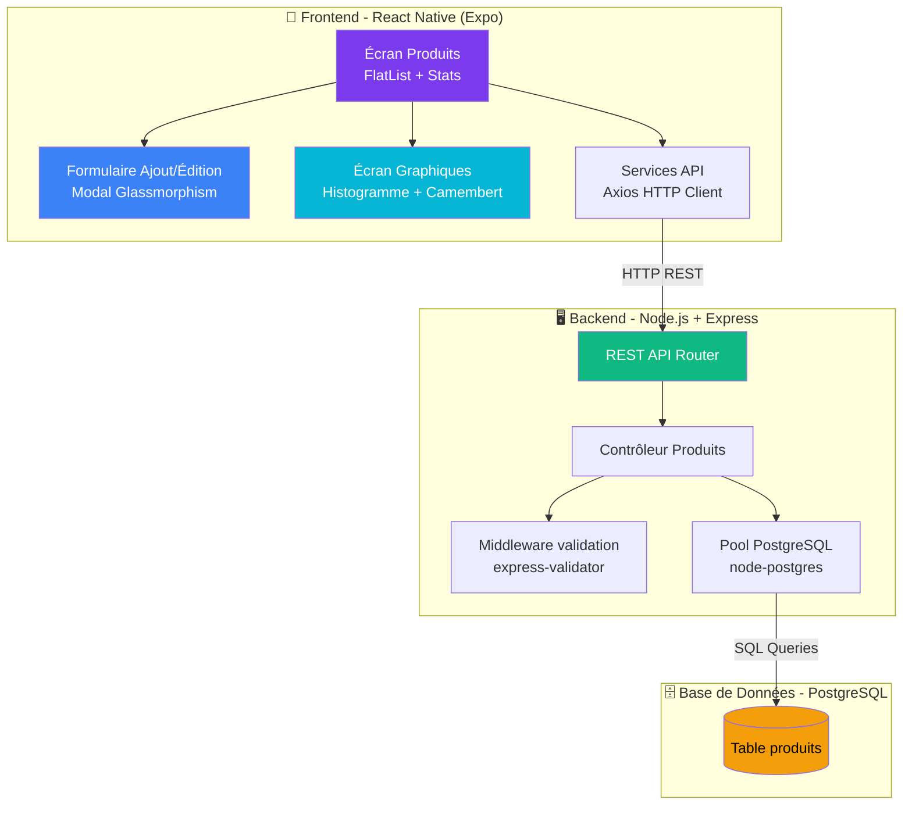
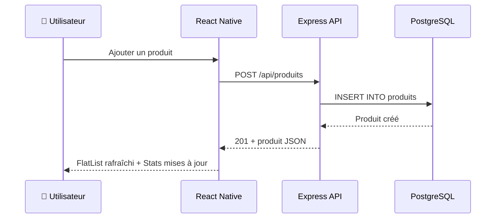
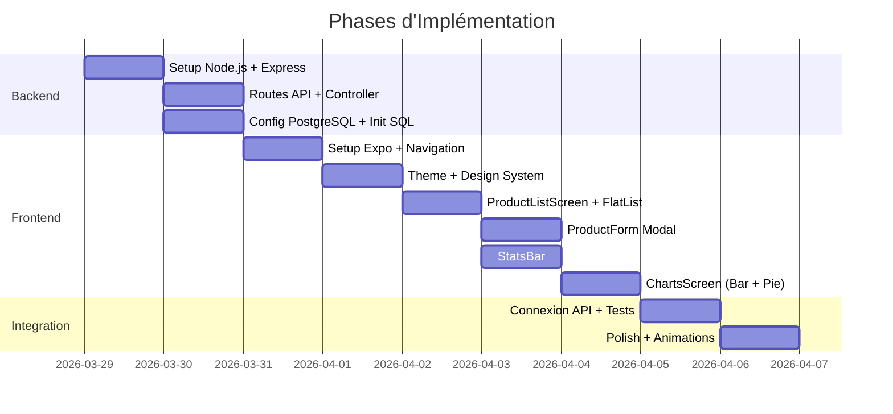

# Plan d'Implémentation — Application Gestion de Produits

## 📋 Cahier de Charge (Sujet 19)

Développer une application hybride React Native avec accès à une base PostgreSQL distante, permettant :

1. **CRUD Produit** — Ajouter des données dans une table `Produit (numProduit, design, prix, quantité)`
2. **Affichage FlatList** — Afficher dans un composant FlatList `(numProduit, design, prix, quantité, montant)` avec `montant = qté × prix`
3. **Modification/Suppression** — Modifier et supprimer un enregistrement depuis le FlatList
4. **Statistiques** — Afficher en bas le montant minimal, maximal, et total `(∑ prix × quantité)`
5. **Graphiques** — Visualiser montant total, min et max dans un histogramme ou camembert

---

## 🏗️ Architecture Technique

### Architecture 3-Tiers



### Flux de Données



---

## 🎨 Design System

### Palette de Couleurs (Dark Theme Premium)

| Rôle | Couleur | Hex | Usage |
|------|---------|-----|-------|
| Background | Deep Navy | `#0F0F1A` | Fond principal |
| Surface | Dark Card | `#1A1A2E` | Cartes, modals |
| Surface Elevated | Lighter | `#252542` | Éléments surélevés |
| Primary | Purple | `#7C3AED` | Actions principales, accents |
| Secondary | Blue | `#3B82F6` | Actions secondaires |
| Accent | Teal | `#06B6D4` | Graphiques, badges |
| Success | Green | `#10B981` | Confirmations, montant positif |
| Danger | Red | `#EF4444` | Suppression, erreurs |
| Warning | Amber | `#F59E0B` | Alertes, max |
| Text Primary | White | `#FFFFFF` | Texte principal |
| Text Secondary | Gray | `#94A3B8` | Labels, sous-titres |
| Border | Subtle | `#2D2D4A` | Séparateurs, bordures |

### Typographie

- **Font** : `Inter` (via Google Fonts / expo-google-fonts)
- **Titres** : Inter Bold, 24-28px
- **Sous-titres** : Inter SemiBold, 18px
- **Corps** : Inter Regular, 14-16px
- **Labels** : Inter Medium, 12px, couleur secondaire

### Composants UI Clés

| Composant | Style |
|-----------|-------|
| **Cartes Produit** | `borderRadius: 16`, fond `#1A1A2E`, ombre subtile, padding 16 |
| **Inputs** | `borderRadius: 12`, fond `#252542`, bordure `#2D2D4A`, focus: bordure `#7C3AED` |
| **Boutons** | Gradient `#7C3AED → #3B82F6`, `borderRadius: 12`, hauteur 48 |
| **FAB (+)** | Cercle 56px, gradient purple/blue, ombre portée |
| **Stats Bar** | Fond `#1A1A2E`, `borderRadius: 16` en haut, 3 colonnes (Min/Max/Total) |
| **Swipe Actions** | Edit = bleu, Delete = rouge, icônes Ionicons |

---

## 🗄️ Schéma de Base de Données

```sql
-- Création de la table produits
CREATE TABLE IF NOT EXISTS produits (
    id              SERIAL PRIMARY KEY,
    num_produit     VARCHAR(20) UNIQUE NOT NULL,
    design          VARCHAR(100) NOT NULL,
    prix            DECIMAL(10, 2) NOT NULL CHECK (prix >= 0),
    quantite        INTEGER NOT NULL CHECK (quantite >= 0),
    created_at      TIMESTAMP DEFAULT CURRENT_TIMESTAMP,
    updated_at      TIMESTAMP DEFAULT CURRENT_TIMESTAMP
);

-- Index pour recherche rapide
CREATE INDEX idx_produits_num ON produits(num_produit);

-- Trigger pour mise à jour automatique de updated_at
CREATE OR REPLACE FUNCTION update_updated_at()
RETURNS TRIGGER AS $$
BEGIN
    NEW.updated_at = CURRENT_TIMESTAMP;
    RETURN NEW;
END;
$$ LANGUAGE plpgsql;

CREATE TRIGGER trigger_update_timestamp
    BEFORE UPDATE ON produits
    FOR EACH ROW
    EXECUTE FUNCTION update_updated_at();
```

> [!NOTE]
> Le champ `montant` (`prix × quantité`) est calculé côté application et non stocké en base, car il est une valeur dérivée. Cela évite les incohérences.

---

## 🔌 API REST — Endpoints

| Méthode | Endpoint | Description | Body/Params |
|---------|----------|-------------|-------------|
| `GET` | `/api/produits` | Lister tous les produits | — |
| `GET` | `/api/produits/:id` | Obtenir un produit | — |
| `POST` | `/api/produits` | Ajouter un produit | `{ num_produit, design, prix, quantite }` |
| `PUT` | `/api/produits/:id` | Modifier un produit | `{ num_produit, design, prix, quantite }` |
| `DELETE` | `/api/produits/:id` | Supprimer un produit | — |
| `GET` | `/api/produits/stats` | Statistiques (min, max, total) | — |

### Exemple de réponse `GET /api/produits`

```json
{
  "success": true,
  "data": [
    {
      "id": 1,
      "num_produit": "P-2319",
      "design": "Zenith Smartband",
      "prix": 149.99,
      "quantite": 85,
      "montant": 12749.15,
      "created_at": "2026-03-29T10:00:00Z"
    }
  ],
  "stats": {
    "montant_min": 5200.00,
    "montant_max": 21999.00,
    "montant_total": 98450.00
  }
}
```

---

## 📂 Structure du Projet

```
React Native 2026/
├── 📱 mobile/                          # Application React Native (Expo)
│   ├── App.js                          # Point d'entrée + Navigation
│   ├── app.json                        # Configuration Expo
│   ├── package.json
│   ├── src/
│   │   ├── screens/
│   │   │   ├── ProductListScreen.js    # Écran principal avec FlatList
│   │   │   └── ChartsScreen.js         # Écran graphiques
│   │   ├── components/
│   │   │   ├── ProductCard.js          # Carte produit (swipeable)
│   │   │   ├── ProductForm.js          # Modal ajout/édition
│   │   │   ├── StatsBar.js             # Barre statistiques (min/max/total)
│   │   │   ├── BarChart.js             # Composant histogramme
│   │   │   └── PieChart.js             # Composant camembert
│   │   ├── services/
│   │   │   └── api.js                  # Client Axios + fonctions API
│   │   ├── theme/
│   │   │   └── theme.js                # Couleurs, typographie, spacing
│   │   └── utils/
│   │       └── formatters.js           # Formatage prix, nombres
│   └── assets/                         # Icônes, images
│
├── 🖥️ server/                          # Backend Node.js + Express
│   ├── package.json
│   ├── server.js                       # Point d'entrée serveur
│   ├── config/
│   │   └── db.js                       # Configuration pool PostgreSQL
│   ├── routes/
│   │   └── produits.js                 # Routes API produits
│   ├── controllers/
│   │   └── produitsController.js       # Logique métier CRUD + Stats
│   ├── middleware/
│   │   └── validation.js               # Validation des entrées
│   └── sql/
│       └── init.sql                    # Script d'initialisation DB
│
└── 📄 README.md                        # Documentation du projet
```

---

## 📱 Écrans de l'Application

### Mockup de Design


---

### Écran 1 : Liste des Produits (`ProductListScreen`)

**Fonctionnalités :**
- **Header** : Titre "Produits" + icône recherche
- **FlatList** : Liste scrollable des cartes produits
  - Chaque carte affiche : `numProduit`, `design`, `prix`, `quantité`, `montant` (calculé)
  - Swipe gauche → boutons **Éditer** (bleu) / **Supprimer** (rouge)
  - Pull-to-refresh pour recharger
- **FAB** : Bouton flottant "+" pour ajouter un produit → ouvre le modal
- **Stats Bar** : Barre fixe en bas avec Min | Max | Total
- **Navigation** : Tab bar avec onglets Produits / Graphiques

### Écran 2 : Formulaire Ajout/Édition (`ProductForm` — Modal)

**Fonctionnalités :**
- Modal overlay avec effet glassmorphism
- Champs : Numéro Produit, Design, Prix (€), Quantité
- Validation en temps réel (champs requis, prix ≥ 0, quantité ≥ 0)
- Bouton "Ajouter" ou "Mettre à jour" selon le mode
- Animation d'apparition (slide-up)

### Écran 3 : Graphiques (`ChartsScreen`)

**Fonctionnalités :**
- **KPI Cards** en haut : Total produits, Valeur moyenne
- **Histogramme** (Bar Chart) : Montant par produit, barres avec gradient
- **Camembert** (Pie Chart) : Répartition des montants entre produits
- **Légende** avec Min, Max, Total en bas avec badges colorés

---

## ⚙️ Stack Technologique

### Frontend (Mobile)
| Technologie | Version | Rôle |
|-------------|---------|------|
| React Native | 0.76+ | Framework mobile |
| Expo | SDK 52+ | Toolchain, build |
| React Navigation | 7.x | Navigation (Tab + Stack) |
| Axios | 1.x | Client HTTP |
| react-native-chart-kit | 6.x | Graphiques (bar + pie) |
| react-native-gesture-handler | 2.x | Swipe actions |
| react-native-reanimated | 3.x | Animations fluides |
| @expo/vector-icons | — | Icônes (Ionicons) |

### Backend (API)
| Technologie | Version | Rôle |
|-------------|---------|------|
| Node.js | 20+ | Runtime serveur |
| Express | 4.x | Framework API REST |
| pg (node-postgres) | 8.x | Driver PostgreSQL |
| cors | 2.x | Cross-origin requests |
| express-validator | 7.x | Validation des entrées |
| dotenv | 16.x | Variables d'environnement |

### Base de Données
| Technologie | Rôle |
|-------------|------|
| PostgreSQL 16+ | SGBD relationnel principal |

---

## 🔧 Proposed Changes

### Backend (Server)

#### [NEW] [server.js](file:///home/shanny/dev/React%20Native%202026/server/server.js)
Point d'entrée Express : configure CORS, JSON parsing, monte les routes `/api/produits`, écoute sur le port 3000.

#### [NEW] [db.js](file:///home/shanny/dev/React%20Native%202026/server/config/db.js)
Configuration du pool PostgreSQL via `pg.Pool` avec variables d'environnement (host, port, user, password, database).

#### [NEW] [produits.js](file:///home/shanny/dev/React%20Native%202026/server/routes/produits.js)
Définition des 6 routes REST (GET all, GET by id, POST, PUT, DELETE, GET stats).

#### [NEW] [produitsController.js](file:///home/shanny/dev/React%20Native%202026/server/controllers/produitsController.js)
Logique métier : requêtes SQL pour CRUD + calcul statistiques (MIN, MAX, SUM via SQL).

#### [NEW] [init.sql](file:///home/shanny/dev/React%20Native%202026/server/sql/init.sql)
Script SQL de création de la table `produits` avec contraintes, index et trigger.

---

### Frontend (Mobile)

#### [NEW] [App.js](file:///home/shanny/dev/React%20Native%202026/mobile/App.js)
Point d'entrée : configuration React Navigation avec TabNavigator (Produits, Graphiques).

#### [NEW] [ProductListScreen.js](file:///home/shanny/dev/React%20Native%202026/mobile/src/screens/ProductListScreen.js)
Écran principal : FlatList des produits, StatsBar, FAB, gestion de l'état.

#### [NEW] [ChartsScreen.js](file:///home/shanny/dev/React%20Native%202026/mobile/src/screens/ChartsScreen.js)
Écran graphiques : histogramme et camembert avec react-native-chart-kit.

#### [NEW] [ProductCard.js](file:///home/shanny/dev/React%20Native%202026/mobile/src/components/ProductCard.js)
Composant carte produit avec swipe-to-edit et swipe-to-delete.

#### [NEW] [ProductForm.js](file:///home/shanny/dev/React%20Native%202026/mobile/src/components/ProductForm.js)
Modal formulaire avec validation pour ajout et modification.

#### [NEW] [StatsBar.js](file:///home/shanny/dev/React%20Native%202026/mobile/src/components/StatsBar.js)
Barre fixe affichant Min, Max, Total des montants.

#### [NEW] [BarChart.js](file:///home/shanny/dev/React%20Native%202026/mobile/src/components/BarChart.js) & [PieChart.js](file:///home/shanny/dev/React%20Native%202026/mobile/src/components/PieChart.js)
Composants graphiques encapsulant react-native-chart-kit.

#### [NEW] [api.js](file:///home/shanny/dev/React%20Native%202026/mobile/src/services/api.js)
Service Axios : baseURL configurable, fonctions `getProducts()`, `addProduct()`, `updateProduct()`, `deleteProduct()`, `getStats()`.

#### [NEW] [theme.js](file:///home/shanny/dev/React%20Native%202026/mobile/src/theme/theme.js)
Design tokens : couleurs, typographie, spacing, borderRadius, shadows.

---

## ✅ Verification Plan

### Tests Automatisés

1. **Test API Backend** — Utiliser `curl` ou un script pour tester chaque endpoint :
   ```bash
   # Démarrer le serveur
   cd /home/shanny/dev/React\ Native\ 2026/server && node server.js

   # Tester POST
   curl -X POST http://localhost:3000/api/produits \
     -H "Content-Type: application/json" \
     -d '{"num_produit":"P-001","design":"Test Product","prix":10.50,"quantite":5}'

   # Tester GET all
   curl http://localhost:3000/api/produits

   # Tester GET stats
   curl http://localhost:3000/api/produits/stats
   ```

2. **Vérification PostgreSQL** — Confirmer que les données sont bien persistées :
   ```bash
   psql -U postgres -d produits_db -c "SELECT *, prix * quantite AS montant FROM produits;"
   ```

### Vérification Manuelle

1. **Lancer l'app mobile** via `npx expo start` dans le dossier `mobile/`
2. **Ajouter 3-4 produits** via le formulaire et vérifier qu'ils apparaissent dans la FlatList
3. **Vérifier le montant** calculé = prix × quantité pour chaque produit
4. **Swipe pour éditer** un produit, modifier le prix, vérifier la mise à jour
5. **Swipe pour supprimer** un produit, confirmer la suppression
6. **Vérifier la Stats Bar** : les valeurs min, max et total doivent être correctes
7. **Naviguer vers l'onglet Graphiques** et confirmer que l'histogramme et le camembert affichent les données correctement

---

## 🔮 Perspectives & Fonctionnalités Futures

### Phase 2 — Améliorations UX
| Fonctionnalité | Description |
|----------------|-------------|
| 🔍 **Recherche & Filtres** | Barre de recherche par nom/numéro, filtres par prix, tri par montant |
| 📱 **Mode Hors-ligne** | Cache local avec SQLite + synchronisation automatique |
| 🌙 **Thème Clair / Sombre** | Toggle entre thème clair et sombre |
| 🔔 **Notifications** | Alertes stock faible (quantité < seuil) |

### Phase 3 — Fonctionnalités Avancées
| Fonctionnalité | Description |
|----------------|-------------|
| 📸 **Photos Produit** | Upload d'images via la caméra ou galerie |
| 📊 **Dashboard Avancé** | Graphiques temporels (évolution des prix, des stocks) |
| 🏷️ **Catégories** | Classification des produits par catégorie |
| 📄 **Export PDF/Excel** | Génération de rapports exportables |
| 👥 **Multi-utilisateurs** | Authentification JWT, rôles (admin, viewer) |

### Phase 4 — Enterprise
| Fonctionnalité | Description |
|----------------|-------------|
| 📦 **Gestion de Stock** | Mouvements d'entrée/sortie, historique, alertes |
| 🔗 **Code-barres / QR** | Scan de code-barres pour ajout rapide |
| 🌐 **Multi-langues** | Internationalisation (FR, EN, AR) |
| ☁️ **Déploiement Cloud** | API hébergée sur Railway/Render, DB sur Supabase |
| 📲 **Build APK/IPA** | Publication sur Google Play / App Store |

---

## 🚀 Ordre d'Implémentation



> [!IMPORTANT]
> **Pré-requis** : PostgreSQL doit être installé et accessible sur la machine. Un fichier `.env` sera créé avec les identifiants de connexion à la base de données.
